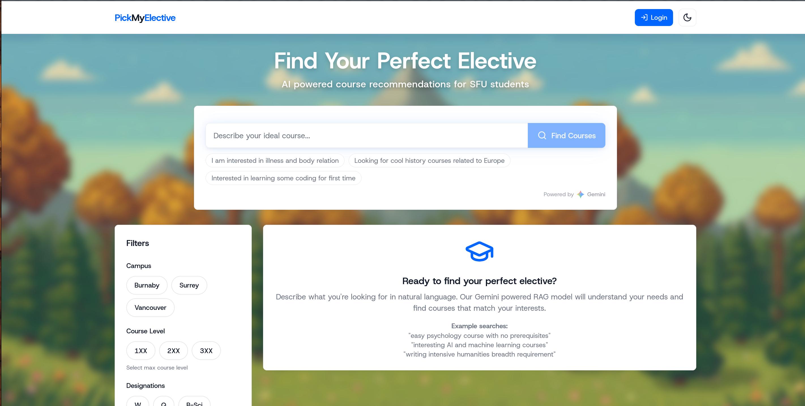
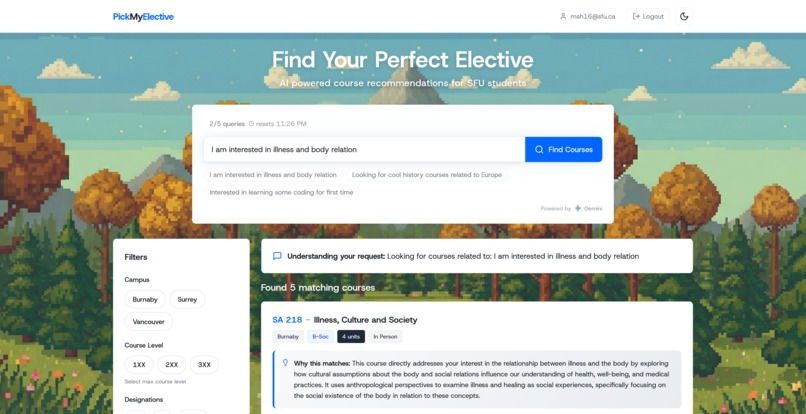
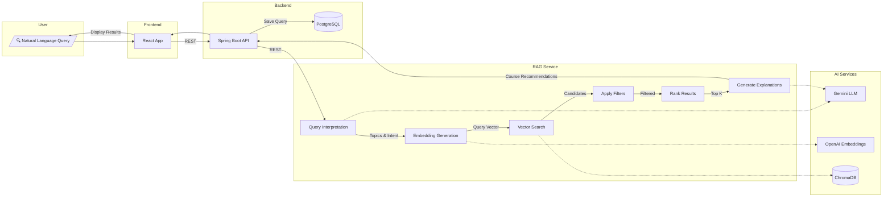

# PickMyElective

[](https://react.dev/)
[](https://spring.io/projects/spring-boot)
[](https://fastapi.tiangolo.com/)
[](https://python.org/)
[](https://openjdk.org/)
[](https://typescriptlang.org/)

An AI-powered course recommendation system that helps university students discover elective courses through natural language search and intelligent filtering.

<p align="center">
  
</p>

<p align="center">
  
</p>

## Features

- **Natural Language Search** — Describe what you're looking for in plain English ("easy science course with no prerequisites")
- **AI-Powered Recommendations** — RAG pipeline with semantic search finds courses that match your intent, not just keywords
- **Smart Filtering** — Filter by campus, course level, WQB designations, prerequisites, and delivery method
- **Personalized Explanations** — Each recommendation includes an AI-generated reason why it matches your search
- **Secure Authentication** — Passwordless OTP login via university email
- **Rate Limiting** — Fair usage limits with automatic reset windows

## Architecture

```
┌─────────────────────────────────────────────────────────────────────────────┐
│                                  Frontend                                    │
│                        React 19 · TypeScript · Tailwind                      │
│                              localhost:5173                                  │
└─────────────────────────────────┬───────────────────────────────────────────┘
                                  │ REST API
                                  ▼
┌─────────────────────────────────────────────────────────────────────────────┐
│                                  Backend                                     │
│                     Spring Boot 3.4 · Java 21 · JPA                         │
│                              localhost:8080                                  │
│  ┌─────────────┐  ┌─────────────┐  ┌─────────────┐  ┌─────────────────────┐ │
│  │    Auth     │  │    Query    │  │ Rate Limit  │  │   Query History     │ │
│  │  (JWT+OTP)  │  │   Service   │  │  (Per User) │  │    (PostgreSQL)     │ │
│  └─────────────┘  └──────┬──────┘  └─────────────┘  └─────────────────────┘ │
└──────────────────────────┼──────────────────────────────────────────────────┘
                           │ REST API
                           ▼
┌─────────────────────────────────────────────────────────────────────────────┐
│                               RAG Service                                    │
│                      FastAPI · Python 3.12 · ChromaDB                        │
│                              localhost:8000                                  │
│  ┌─────────────────────────────────────────────────────────────────────┐    │
│  │                         RAG Pipeline                                 │    │
│  │  1. Query Interpretation (Gemini) → Extract topics & intent         │    │
│  │  2. Embedding Generation (OpenAI) → text-embedding-3-large          │    │
│  │  3. Semantic Search (ChromaDB) → Vector similarity + filters        │    │
│  │  4. Ranking (80% relevance + 20% elective score)                    │    │
│  │  5. Match Reason Generation (Gemini) → Personalized explanations    │    │
│  └─────────────────────────────────────────────────────────────────────┘    │
└─────────────────────────────────────────────────────────────────────────────┘
```

The system uses a **three-tier microservices architecture**:

| Service | Responsibility | Key Technologies |
|---------|---------------|------------------|
| **Frontend** | User interface, search experience, filters | React 19, TypeScript, Vite, Tailwind CSS |
| **Backend** | Authentication, rate limiting, query history | Spring Boot 3.4, Java 21, PostgreSQL, JWT |
| **RAG Service** | Course recommendations, semantic search | FastAPI, ChromaDB, OpenAI Embeddings, Gemini |

### Search Pipeline



**Pipeline Steps:**
1. **Query Interpretation** — Gemini extracts topics and intent from natural language
2. **Embedding Generation** — OpenAI creates a vector representation of the query
3. **Vector Search** — ChromaDB finds semantically similar courses
4. **Apply Filters** — Filter by campus, level, WQB, prerequisites
5. **Rank Results** — Score = 80% semantic relevance + 20% elective quality
6. **Generate Explanations** — Gemini explains why each course matches

## Tech Stack

| Layer | Technology | Purpose |
|-------|------------|---------|
| **Frontend** | React 19, TypeScript, Vite | Modern SPA with type safety |
| **Styling** | Tailwind CSS 4 | Utility-first CSS framework |
| **Backend** | Spring Boot 3.4, Java 21 | REST API with JPA/Hibernate |
| **Database** | PostgreSQL (Supabase) | User data and query history |
| **Vector DB** | ChromaDB | Semantic search over course embeddings |
| **Embeddings** | OpenAI text-embedding-3-large | High-quality vector representations |
| **LLM** | Google Gemini | Query interpretation and match explanations |
| **Auth** | JWT + OTP | Passwordless authentication via Resend |

## Quick Start

### Prerequisites

- Node.js 18+
- Java 21
- Python 3.12
- Maven 3.9+

<details>
<summary><strong>1. RAG Service Setup</strong></summary>

```bash
cd rag

# Create virtual environment
python -m venv .venv
source .venv/bin/activate  # Windows: .venv\Scripts\activate

# Install dependencies
pip install -e .

# Configure environment
cp .env.example .env
# Edit .env with your API keys:
# OPENAI_API_KEY=sk-...
# GOOGLE_API_KEY=...

# Start service
python scripts/run_server.py
```

Runs on `http://localhost:8000`

</details>

<details>
<summary><strong>2. Backend Setup</strong></summary>

```bash
cd backend/demo

# Configure environment
cp .env.example .env
# Edit .env with your credentials:
# SUPABASE_DB_URL=jdbc:postgresql://...
# SUPABASE_DB_USERNAME=postgres
# SUPABASE_DB_PASSWORD=...
# JWT_SECRET=...
# RESEND_API_KEY=re_...

# Build and run
./mvnw spring-boot:run
```

Runs on `http://localhost:8080`

</details>

<details>
<summary><strong>3. Frontend Setup</strong></summary>

```bash
cd frontend

# Install dependencies
npm install

# Start development server
npm run dev
```

Runs on `http://localhost:5173`

</details>

### Running All Services

```bash
# Terminal 1 - RAG Service
cd rag && source .venv/bin/activate && python scripts/run_server.py

# Terminal 2 - Backend
cd backend/demo && ./mvnw spring-boot:run

# Terminal 3 - Frontend
cd frontend && npm run dev
```

## API Reference

<details>
<summary><strong>Backend Endpoints (Port 8080)</strong></summary>

| Method | Endpoint | Description |
|--------|----------|-------------|
| `POST` | `/auth/login` | Request OTP for email |
| `POST` | `/auth/verify` | Verify OTP, receive JWT |
| `POST` | `/api/query` | Submit course search query |
| `GET` | `/api/query/history` | Get user's query history |
| `GET` | `/api/query/limit` | Get remaining query count |

</details>

<details>
<summary><strong>RAG Service Endpoints (Port 8000)</strong></summary>

| Method | Endpoint | Description |
|--------|----------|-------------|
| `POST` | `/api/recommend` | Get course recommendations |
| `GET` | `/health` | Health check |

</details>

## Project Structure

```
pickmyelective/
├── frontend/                 # React SPA
│   ├── src/components/       # UI components
│   ├── src/context/          # Auth & theme state
│   └── src/services/         # API client
├── backend/demo/             # Spring Boot API
│   ├── src/.../controller/   # REST endpoints
│   ├── src/.../service/      # Business logic
│   └── src/.../model/        # JPA entities
├── rag/                      # Python RAG service
│   ├── src/query/            # Query engine
│   ├── src/index/            # ChromaDB indexing
│   └── scripts/              # Data pipeline
└── docs/                     # Documentation
```

## Documentation

- [Technical Architecture](docs/TECHNICAL_ARCHITECTURE.md)
- [API Contracts](docs/API_CONTRACTS.md)
- [Data & RAG Pipeline](docs/DATA_RAG_PIPELINE.md)

## License

MIT
